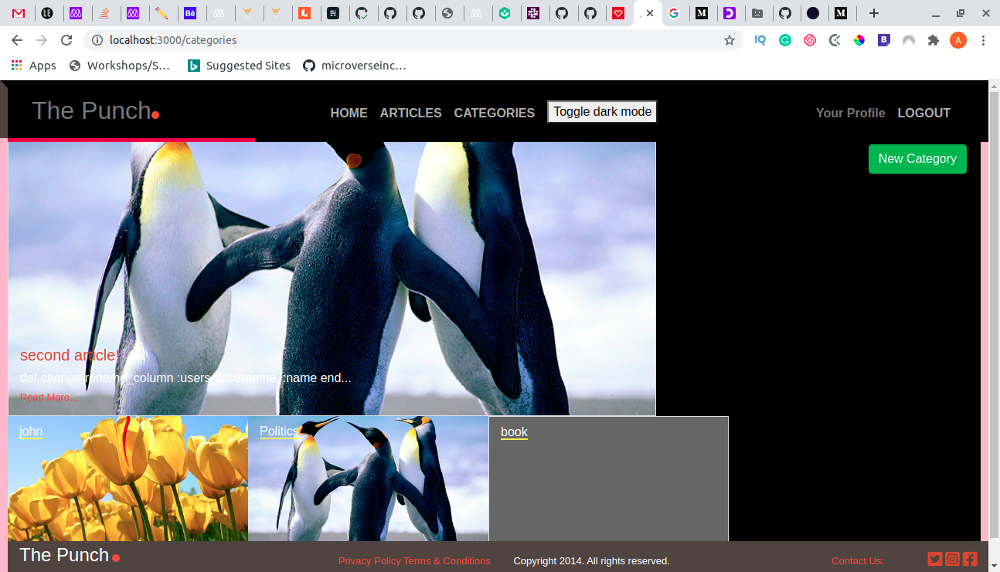

## Ruby on Rails Capstone (

### Articles Blog Description
This Project is based on posting and voting on articles. The article with the highest number of votes is displayed as the main article on the home page. There are various categories articles belongs to.

## Built With
This project development was achieved using the following technologies:

- Ruby on Rails,
- Bootstrap and CSS
- Rspec

## Live Demo

I dont have it yet

## Home Page of the Application

## Getting Started

To get a local copy up and running follow these simple example steps.

### Prerequisites

#### You should have installed git on your local machine and a text editor of your choice.
### Setup

- Forking the project-Repository
- Cloning the project to your local machine
- `cd` into the project directory
- Run `bundle install` to install the Gemfiles
- Run `db:migrate` to install the Gemfiles
- From the root directory, run `rails server` to start the Project on `localhost:3000`

## Checking the tests with RSpec
The tests for the model and controllers was implemented using RSpec gem. To execute these test cases, run `bundle exec rspec ` to display the test cases of the application. 

## Author

👤 **Author**

- Github: [@haraphat01](https://github.com/haraphat01)
- Twitter: [@haraphat01](https://twitter.com/haraphat01)

## 🤝 Contributing

Contributions, issues and feature requests are welcome! Start by:

- Forking the project
- Cloning the project to your local machine
- `cd` into the project directory
- Run `git checkout -b your-branch-name`
- Make your contributions
- Push your branch up to your forked repository
- Open a Pull Request with a detailed description to the development branch of the original project for a review

## Credits

Thanks to [Nelson Sakwa and others on Behance](https://www.behance.net/sakwadesignstudio) for his awesome design work. I based my work on  [this](https://www.behance.net/gallery/14554909/liFEsTlye-Mobile-version) design.

## Show your support

Give a ⭐️ if you like this project!

Feel free to check the [issues page](issues/).

## Show your support

Give a ⭐️ if you like this project!

## Acknowledgments

- Appreciation to my coding Partner and mentor

## 📝 License

This project is [MIT](lic.url) licensed.
